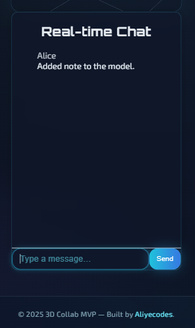

# Collaborative 3D Sharing Web App
*(Full Stack Selection Project – Designo, 2nd Round)*  

---

### Screenshots

| Dark Mode | Light Mode |
|:---------:|:----------:|
|  |  |

| Project View | Annotation Example | Real Time Chat |
|:------------:|:------------------:|:--------------:|
|  |  |  |

### Live Demo  
- **Frontend (Vercel):** [https://collab-3d.vercel.app](https://collab-3d.vercel.app)  
- **Backend (Render):** [https://collab-3d-nn3k.onrender.com](https://collab-3d-nn3k.onrender.com)  

---

## English Version  

### Overview  
Collab 3D is a real-time collaborative 3D workspace built with React, Three.js, Socket.IO, Express, and MongoDB.  
You can create projects, move and rotate 3D models, add annotations, and collaborate live through a shared session link.

This project was part of my Full Stack Developer selection task at Designo, where I explored real-time collaboration tools and 3D visualization.

---

### Core Features  
| Requirement | Implemented |
|--------------|--------------|
| Dummy login (no auth, local user simulation) | ✅ |
| Create & list 3D projects | ✅ |
| 3D scene with cube primitive | ✅ |
| OrbitControls (pan, zoom, rotate) | ✅ |
| TransformControls (move, rotate, scale) | ✅ |
| Real-time chat via Socket.IO | ✅ |
| Real-time sync: camera, annotations, chat | ✅ |
| Scene persistence in MongoDB | ✅ |
| Responsive design (TailwindCSS) | ✅ |
| Dark/light theme toggle | ✅ |
| STL/STEP upload | ⚠️ Planned |
| Multiple models per project | ⚠️ Planned |
| Cutting plane / advanced annotations | ⚠️ Planned |

---

### How to Use  
1. Enter your name on the login screen (e.g. *Alice*, *Bob*).  
2. Create a new project or join an existing one via URL.  
3. Rotate, move, and scale the 3D object.  
4. Double-click on the model to add annotations.  
5. Chat with other users in real time.  
6. Toggle between dark and light mode.  
7. Refresh the page — the scene and annotations will reload from MongoDB.

---

### How Real-Time Sync Works
Each user joins a project room via **Socket.IO**:
- **join** → connects users to the same project room  
- **chat** → sends and receives real-time chat messages  
- **annotation:add** → broadcasts annotation creation and updates  
- **camera** → shares the live camera position and target between users  
- **object:update** → synchronizes 3D transformations (move, rotate, scale) in real time  

---

### Tech Stack  
**Frontend:** React, Three.js, TailwindCSS  
**Backend:** Node.js (Express), Socket.IO  
**Database:** MongoDB (Mongoose ODM)  
**Hosting:** Vercel (frontend) + Render (backend)  
**Real-time:** WebSocket via Socket.IO  

---

### Recent Fixes & Improvements
- Fixed **CORS origin handling** for deployed environments  
- Added **chat persistence** (messages are now stored in MongoDB)  
- Added **object:update** event for real-time 3D sync  
- Improved **debug logs** for Socket.IO connection and synchronization events  
- Enhanced **stability** across multiple concurrent clients  

---

### Future Improvements  
- STL/STEP upload via `STLLoader` and `GLTFLoader`  
- Multi-object scene management  
- Cutting plane (clipping shader)  
- Advanced annotation types (pins, labels, arrows)  

---

## Versione Italiana  

### Panoramica  
Collab 3D è uno spazio di lavoro 3D collaborativo in tempo reale, sviluppato con React, Three.js, Socket.IO, Express e MongoDB.  
Permette di creare progetti, muovere e ruotare modelli 3D, aggiungere annotazioni e collaborare con altri utenti in una sessione condivisa.

Questo progetto faceva parte della mia selezione come Full Stack Developer presso Designo, dove ho esplorato strumenti di collaborazione in tempo reale e visualizzazione 3D.

---

### Funzionalità Principali  
| Requisito | Stato |
|------------|--------|
| Login fittizio (nessuna autenticazione) | ✅ |
| Creazione e lista dei progetti 3D | ✅ |
| Scena 3D con cubo primitivo | ✅ |
| Controllo della camera (pan, zoom, rotazione) | ✅ |
| Manipolazione oggetti (move, rotate, scale) | ✅ |
| Chat in tempo reale | ✅ |
| Sincronizzazione live (camera, annotazioni, chat) | ✅ |
| Salvataggio dei dati su MongoDB | ✅ |
| Design responsive (TailwindCSS) | ✅ |
| Tema chiaro/scuro (dark/light theme toggle) | ✅ |
| Caricamento STL/STEP | ⚠️ In sviluppo |
| Modelli multipli per progetto | ⚠️ In sviluppo |
| Piano di taglio / annotazioni avanzate | ⚠️ In sviluppo |

---

### Come si Usa  
1. Inserisci un nome nella schermata iniziale (es. *Alice*, *Bob*).  
2. Crea un nuovo progetto o unisciti a uno esistente tramite URL.  
3. Muovi, ruota e scala il modello 3D.  
4. Fai doppio clic per aggiungere annotazioni o note.  
5. Usa la chat per collaborare in tempo reale.  
6. Passa tra la modalità chiara e scura.  
7. Ricarica la pagina: scena e annotazioni vengono ripristinate dal database.  

---

### Come funziona la sincronizzazione in tempo reale
Ogni utente entra in una stanza del progetto tramite **Socket.IO**:
- **join** → connette gli utenti alla stessa stanza del progetto  
- **chat** → invia e riceve messaggi in tempo reale  
- **annotation:add** → trasmette in tempo reale la creazione e le modifiche delle annotazioni  
- **camera** → condivide la posizione e il target della camera tra gli utenti  
- **object:update** → sincronizza in tempo reale i movimenti 3D (move, rotate, scale)  

---

### Stack Tecnologico  
**Frontend:** React, Three.js, TailwindCSS  
**Backend:** Node.js (Express), Socket.IO  
**Database:** MongoDB (Mongoose)  
**Hosting:** Vercel (frontend) + Render (backend)  
**Realtime:** WebSocket con Socket.IO  

---

### Correzioni e miglioramenti recenti
- Corretto il **CORS origin handling** per gli ambienti di produzione  
- Aggiunta la **persistenza della chat** (i messaggi vengono ora salvati su MongoDB)  
- Aggiunto l’evento **object:update** per la sincronizzazione 3D in tempo reale  
- Migliorati i **log di debug** per la connessione e la sincronizzazione Socket.IO  
- Migliorata la **stabilità** durante l’uso simultaneo da parte di più utenti  

---

### Miglioramenti Futuri  
- Caricamento STL/STEP tramite `STLLoader` e `GLTFLoader`  
- Gestione di oggetti multipli  
- Piano di taglio (shader di clipping)  
- Annotazioni avanzate (etichette, frecce, note)  
